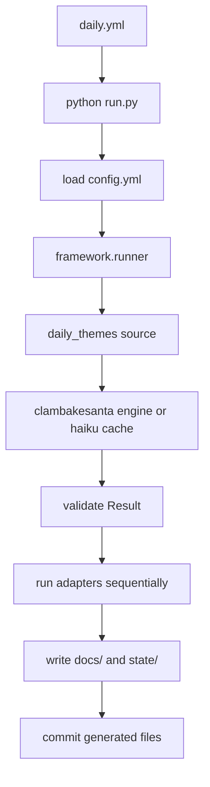

<div align="center">
  

# ClamBakeSanta

> *One bot. One ocean. Infinite holidays.*
</div>

ClamBakeSanta is a GitHub-Actions-driven Python automation project that generates daily haikus from curated holiday, birthday, ephemeral-holiday, and celestial-event data, then publishes them through a plugin-based adapter pipeline.

This README describes the current implementation, not just the original design intent.

---

## Current status

| Area | Status | Notes |
|---|---|---|
| Daily haiku generation | Implemented | `daily.yml` runs `python run.py`; `framework.runner` executes source → engine/cache → adapters → state. |
| Theme selection | Implemented | `daily_themes` reads fixed holidays, generated ephemeral holidays, celebrity birthdays, and celestial events with priority/cap logic. |
| Monthly generated data | Implemented | `generate_monthly.yml` runs `scripts/generate_monthly_data.py` monthly; `daily_themes` can auto-generate missing current-month files as fallback. |
| AI generation and validation | Implemented | `clambakesanta` calls an OpenAI-compatible API, validates 5-7-5 syllables, retries, and logs writer's block. |
| Same-day haiku cache | Implemented | `state/haiku_cache.json` ensures all adapters use the same poems for a date. |
| Publishing adapters | Implemented/credential-gated | Adapters run sequentially in `config.yml` order. Missing credentials usually cause graceful skips. |
| Engagement tracking | Implemented | `check_engagement.yml` reads stored post IDs and writes `state/engagement/`. |
| Weekly report | Implemented | `weekly_report.yml` emails a ranked engagement report to `REPORT_EMAIL`. |
| Email digest delivery | Implemented if configured | `email_list` reads `state/subscribers.json` and sends daily mail through Gmail SMTP. |
| Automated subscription management | Not yet implemented | `check_subscriptions.yml` exists, but `check_subscriptions.py` is placeholder/demo code. See `docs/subscription-status.md`. |

---

## Where to find ClamBakeSanta

<table>
<tr><th>Platform</th><th>Link</th></tr>
<tr><td>Website</td><td><a href="https://soylentaquamarine.github.io/ClamBakeSanta">soylentaquamarine.github.io/ClamBakeSanta</a></td></tr>
<tr><td>RSS Feed</td><td><a href="https://soylentaquamarine.github.io/ClamBakeSanta/feed.xml">feed.xml</a></td></tr>
<tr><td>Mastodon</td><td><a href="https://mastodon.social/@ClamBakeSanta">@ClamBakeSanta@mastodon.social</a></td></tr>
<tr><td>Bluesky</td><td><a href="https://bsky.app/profile/clambakesanta.bsky.social">@clambakesanta.bsky.social</a></td></tr>
<tr><td>Tumblr</td><td><a href="https://www.tumblr.com/clambakesanta">tumblr.com/clambakesanta</a></td></tr>
<tr><td>Telegram</td><td><a href="https://t.me/clambakesanta">t.me/clambakesanta</a></td></tr>
<tr><td>Reddit</td><td><a href="https://reddit.com/u/TheClamBakeSanta">u/TheClamBakeSanta</a></td></tr>
<tr><td>WordPress</td><td><a href="https://clambakesanta.wordpress.com">clambakesanta.wordpress.com</a></td></tr>
</table>

Email subscription note: the daily email adapter can send to addresses already present in `state/subscribers.json`, but automated inbox-based SUBSCRIBE/UNSUBSCRIBE handling is not finished yet.

---

## Scheduled workflows

Schedules live in `.github/workflows/*.yml`. They are not controlled by `config.yml`.

| Workflow | Schedule | Entry point | Purpose |
|---|---:|---|---|
| `generate_monthly.yml` | `0 7 1 * *` | `scripts/generate_monthly_data.py` | Generate next month's ephemeral and celestial data. |
| `check_subscriptions.yml` | `0 8 * * *` | `check_subscriptions.py` | Scheduled placeholder for future mailbox processing. |
| `daily.yml` | `0 9 * * *` | `run.py` | Generate/cache haikus, run adapters, update `docs/` and `state/`. |
| `check_engagement.yml` | `0 22 * * *` | `check_engagement.py` | Fetch engagement metrics for recent posts. |
| `weekly_report.yml` | `0 13 * * 0` | `weekly_report.py` | Email weekly engagement report. |

All workflows also support manual `workflow_dispatch` triggers. `run.py` supports `--regenerate`, but `daily.yml` currently exposes only the `force` input.

---

## Daily pipeline



The active source is `daily_themes`. It selects up to `max_haikus_per_day` themes in this order:

1. Fixed holidays from `data/MONTH_randomholiday.txt`
2. Ephemeral holidays from `data/ephemeral/YYYY-MM.txt`
3. Celebrity birthdays from `data/MONTH_celebritybirthday.txt`
4. Celestial events from `data/celestial/YYYY-MM.txt`, capped by `max_celestial_per_day`

The engine generates one haiku per theme, validates 5-7-5 syllables, retries on mismatch, records writer's block, and falls back if all scheduled themes fail.

---

## Configuration

`config.yml` controls application behavior:

- Site identity and base URL
- Active source plugin
- Active engine plugin
- Adapter list and adapter order
- AI model settings
- Theme caps
- Fallback themes
- Data/output/state paths
- Plugin modules to import

`config.yml` does not define GitHub Actions schedules. To change workflow timing, edit the corresponding file in `.github/workflows/`.

---

## State and generated output

Important generated or maintained paths:

| Path | Purpose |
|---|---|
| `docs/` | GitHub Pages output, generated by the `github_pages` adapter. |
| `state/haiku_cache.json` | Same-day generated haiku cache. |
| `state/haiku_log/` | Generated haiku history and recent anti-repetition input. |
| `state/run_log/` | Per-run summaries. |
| `state/writers_block/` | Failed AI attempts for later review. |
| `state/post_ids/` | Per-platform post IDs and URLs used by engagement tracking. |
| `state/engagement/` | Engagement snapshots and summaries. |
| `state/subscribers.json` | Intended subscriber list read by the email adapter. |

See `diagrams/state-files.md` for the detailed state map and retention notes.

---

## Email subscriptions

There are two separate concepts:

1. **Daily digest delivery** — implemented in `plugins/adapters/email_list.py`.
2. **Automated subscription management** — not yet implemented.

The scheduled workflow `check_subscriptions.yml` exists, but the current `check_subscriptions.py` file is placeholder/demo code. It does not yet poll Gmail, parse SUBSCRIBE/UNSUBSCRIBE messages, update `state/subscribers.json`, or send real confirmation/farewell replies.

See `docs/subscription-status.md` for the current status and implementation plan.

---

## Analytics

Publishing adapters that receive platform post IDs store them under `state/post_ids/`. The engagement workflow reads those IDs and fetches available metrics.

Current score formula:

```text
score = likes + (2 × shares) + (3 × replies)
```

`weekly_report.py` builds a ranked HTML email report from `state/engagement/`.

---

## Diagrams

Mermaid diagrams live in `diagrams/`:

| Diagram | What it shows |
|---|---|
| `diagrams/architecture.md` | Current system architecture and workflow boundaries. |
| `diagrams/daily-workflow-sequence.md` | Actual daily runner sequence. |
| `diagrams/theme-selection.md` | Priority/cap logic for choosing haiku themes. |
| `diagrams/writers-block.md` | Retry/fallback behavior for AI generation. |
| `diagrams/workflow-schedule.md` | GitHub Actions schedules and manual inputs. |
| `diagrams/state-files.md` | State ownership and retention. |
| `diagrams/data-generation.md` | Monthly data generation. |

---

## File layout

```text
.github/workflows/        GitHub Actions schedules and manual workflows
framework/                Core runner, registry, models, validation, state helpers
plugins/sources/          Source plugins such as daily_themes
plugins/engines/          Engine plugins such as clambakesanta
plugins/adapters/         Publishing adapters
data/                     Human-maintained and generated theme data
diagrams/                 Mermaid architecture and workflow documentation
docs/                     GitHub Pages output and project docs
scripts/                  Utility scripts such as monthly data generation
state/                    Runtime state committed by workflows
```

---

## Local usage

Install dependencies:

```bash
pip install -r requirements.txt
```

Run the daily pipeline:

```bash
python run.py
```

Force a run even if today was already processed:

```bash
python run.py --force
```

Force fresh AI generation and overwrite today's cache:

```bash
python run.py --force --regenerate
```

Run one adapter only, using the cached/generated result:

```bash
python run.py --force --adapter mastodon
```

Generate monthly data:

```bash
python scripts/generate_monthly_data.py --month 2026-08
```

Check engagement:

```bash
python check_engagement.py --days 3
```

Send weekly report:

```bash
python weekly_report.py --days 7
```

---

## Documentation accuracy note

This repository evolves through working code and scheduled GitHub Actions. When the code and documentation disagree, prefer the code and workflow files as the source of truth, then update the docs to match.
