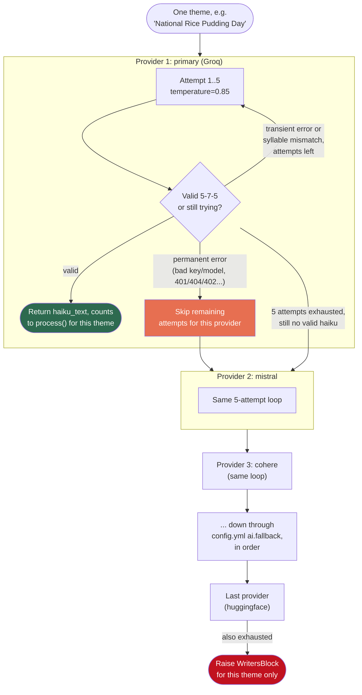

# AI Backend — Multi-Provider Fallback Chain

How haiku generation actually calls an AI, why it's not just one provider, and
how to test/extend it without risking a live post to real subscribers/socials.

## Why this exists

GitHub Models (the original free AI backend) was fully retired 2026-07-30 with
no warning, which silently zeroed out haiku generation for 10 days before
anyone noticed (see `state/run_log/` history around 2026-07-31). The fix
wasn't "pick a new provider" — free AI provider tiers turned out to be
individually unreliable (deprecated models, shared-pool rate limits, quota
quirks). The real fix was: **never depend on just one provider again**, plus
an immediate email alert if a day still produces zero haikus despite that.

## The cascade



This whole cascade runs **once per theme**, independently. A theme that
succeeds on the primary provider never touches the fallback chain. A theme
that fails on the primary tries every fallback in order before it's marked
writer's block — see [Writer's Block Handling](writers-block.md) for what
happens after that (fallback theme, `state/writers_block/` logging, etc).

Code: `_generate()` in `plugins/engines/clambakesanta.py` runs the cascade;
`_providers()` in the same file builds the ordered list from config + env vars.

## Current provider chain

Ordered by confidence, in `config.yml` under `ai.fallback` (primary is set by
`ai.model` + `CBS_AI_KEY`/`CBS_AI_BASE_URL` env vars, not the fallback list).

| # | Provider | Status (as of 2026-08-10) | Model | Notes |
|---|---|---|---|---|
| 1 | **Groq** (primary) | ✅ Working | `openai/gpt-oss-20b` | Reasoning model — needs `reasoning_effort: low` |
| 2 | **Mistral** | ✅ Working | `mistral-small-latest` | Don't send `reasoning_effort` — rejects "low"/"medium" |
| 3 | **Cohere** | ✅ Working | `command-r7b-12-2024` | Same `reasoning_effort` restriction as Mistral |
| 4 | **Cerebras** | ✅ Working | `gpt-oss-120b` | Reasoning model, needs `reasoning_effort: low`. Two earlier model ids (`llama3.1-8b`, `llama-3.3-70b`) were stale/404 |
| 5 | **OpenRouter** | ⚠️ Unreliable | `google/gemma-4-31b-it:free` | `:free` models route through a shared pool — repeatedly 429s on congestion, not fixable by retrying |
| 6 | **Pollinations** | ✅ Working (anonymous) | `openai` | `optional_key: true` — authenticated requests need a "pollen" balance, anonymous ones don't |
| 7 | **Gemini** | ❌ Blocked | `gemini-2.0-flash` | Returns quota `limit: 0` — Google requires linking a billing account to unlock actual free quota on this project |
| 8 | **Fireworks** | ⚠️ Partially working | `accounts/fireworks/models/gpt-oss-20b` | Two Llama model ids 404'd — Fireworks dropped plain Llama from serverless entirely (current catalog: DeepSeek/Kimi/GLM/Qwen/MiniMax/gpt-oss/Nemotron, confirmed via their models page). gpt-oss-20b works but even at `reasoning_effort: low` occasionally still burns its token budget, plus this account hit real rate limits during testing |
| 9 | **HuggingFace** | ✅ Working (capped) | `meta-llama/Llama-3.1-8B-Instruct` | Router auto-selects a provider by default — no "enable a provider" step needed despite what the error text implies. Runs out of free monthly credits fast if over-tested |

Removed entirely (tried, deliberately dropped — see git log for
`config.yml` around 2026-08-09/10 for the full reasoning):

- **OpenAI** — worked once the key was rotated, but $0 billing credits; not worth funding as a backstop when 6+ other providers already work for free
- **Together** — free credits exhausted
- **DeepSeek** — no free tier at all, real balance required
- **SambaNova** — requires a payment method on file even at $0 spend

Not wired in at all:

- **Cloudflare Workers AI** — different request/response shape, not
  OpenAI-compatible, would need real code changes plus an account ID we don't
  pass around
- **Ollama** (local) — GitHub Actions runners can't reach a home machine
  without a public tunnel (ngrok/Cloudflare Tunnel), which would make the
  daily run depend on that machine being powered on and online every morning

## The rules (hard-won, 2026-08-09/10)

1. **`reasoning_effort` is provider-specific, never send it blindly.**
   Reasoning models (Groq/Cerebras `gpt-oss-*`) will silently burn their
   entire `max_tokens` budget on hidden chain-of-thought and return **empty
   content** at default effort — looks like a dead API, not a config issue,
   unless you know to check `finish_reason`. Setting `reasoning_effort: low`
   fixes it. But sending that same parameter to Mistral or Cohere gets a hard
   `400`/`422` — they don't support `"low"`/`"medium"` at all. Solution: set
   `reasoning_effort` per-provider in `config.yml` (only where needed), never
   as a blanket default. See `providers[i]["reasoning_effort"]` in
   `_providers()`.

2. **A `400`/`401`/`402`/`404` from a provider is a config problem, not a
   flaky API — don't retry it 5 times.** `_is_permanent_failure()` matches
   on these (plus balance/quota-zero phrases) and breaks out of that
   provider's retry loop immediately, moving to the next provider. Without
   this, a single misconfigured provider wastes ~5x its own latency on every
   theme, every run, forever.

3. **Model IDs go stale fast — verify against the provider's live docs, not
   memory.** Every provider we manually configured a model for got it wrong
   at least once (Cerebras twice). When a provider 404s with "model not
   found" or similar, don't just guess a different name — fetch that
   provider's actual current model list.

4. **Error text can be misleading.** HuggingFace's 400 said "not supported by
   any provider you have enabled" — reads like an account setting is missing.
   It isn't; HF's router auto-selects across all providers by default. The
   real issue was the model just isn't hosted anywhere on their router. Read
   docs before acting on an error message's implied fix.

5. **`optional_key: true` exists for providers that work anonymously**
   (Pollinations). Don't skip a provider just because no secret is
   configured for it if its own docs say auth is optional.

6. **Testing burns real, finite quota.** Several providers (HuggingFace,
   Together, Fireworks' $1 credit) have small enough free allowances that a
   single afternoon of manual testing can exhaust them for the rest of the
   month. Prefer `--engine-only` test runs (below) over repeated live
   `daily.yml` triggers, and don't re-test a provider that already passed
   just to double-check.

7. **A GitHub Actions run "succeeding" (`conclusion: success`) does NOT mean
   haikus posted.** The runner intentionally marks a zero-haiku day as
   "complete" to avoid retry-spam — so no Actions failure notification ever
   fires on its own. The `state/run_log/` entry's `haikus_posted` count is
   the only reliable signal, plus the failure-alert email described below.

## How to test

**Never trigger `daily.yml` (the real "Daily Haiku Generation" workflow) just
to test a provider** — a successful run posts to Mastodon, Bluesky, Tumblr,
Telegram, WordPress, and emails every subscriber. Use one of these instead:

### 1. Test one specific provider (safe, no posting)

Actions → **Test AI Backend** → Run workflow, or:

```bash
gh workflow run "Test AI Backend" --ref main \
  -f ai_key_secret="CEREBRAS_API_KEY" \
  -f ai_base_url="https://api.cerebras.ai/v1" \
  -f ai_model="gpt-oss-120b"
```

Forces that provider as `primary` via `CBS_AI_KEY`/`CBS_AI_BASE_URL`/
`CBS_AI_MODEL`, runs `python run.py --force --regenerate --engine-only`
(engine only — every adapter is skipped, nothing is posted or emailed
anywhere), and logs pass/fail per theme.

### 2. Test the whole fallback chain for real

Same workflow, leave `ai_key_secret` blank:

```bash
gh workflow run "Test AI Backend" --ref main -f ai_key_secret=""
```

Every fallback secret is already wired into that workflow's env block, so
`config.yml`'s `ai.fallback` list runs exactly as it would on the real daily
run — except primary (Groq) is intentionally unset, so it skips straight to
the fallback chain. Useful for confirming the cascade order and catching a
newly-broken provider.

### 3. Test a provider that needs no key, fully locally

If a provider works anonymously (like Pollinations), you don't need GitHub
Actions at all:

```bash
python3 -c "
from openai import OpenAI
client = OpenAI(base_url='https://text.pollinations.ai/openai', api_key='')
resp = client.chat.completions.create(
    model='openai',
    messages=[{'role':'user','content':'Say OK'}],
    max_tokens=20,
)
print(resp.choices[0].message.content)
"
```

### Reading the results

```bash
gh run view <run-id> --log 2>&1 | grep -iE "Haiku OK|Run complete|API error via|Skipping provider|exhausted|permanent"
```

- `Haiku OK` — that theme succeeded, whichever provider is named in the
  preceding `Valid haiku via '<name>'` line
- `Skipping provider 'X' — no API key set` — that secret isn't configured
  (or is empty)
- `Provider 'X' failure looks permanent` — fast-skipped, see the rules above
- `Provider 'X' exhausted after 5 attempt(s)` — retried the full 5x, still
  no valid haiku (either persistent transient errors or repeated syllable
  mismatches)
- `Run complete | ... adapters_ok=[]` — confirms nothing was posted
  (`--engine-only` did its job)

## How to add a new provider

1. Get an API key (or confirm the provider works anonymously).
2. Find its OpenAI-compatible base URL and a plain (non-reasoning) model ID
   from its **current** docs — don't reuse an ID from memory or an old
   example.
3. Add a GitHub secret: `gh secret set YOUR_PROVIDER_API_KEY --repo SoylentAquamarine/clambakesanta`
4. Add an entry to `config.yml` → `ai.fallback`:
   ```yaml
   - name: yourprovider
     base_url: https://api.yourprovider.com/v1
     key_env: YOUR_PROVIDER_API_KEY
     model: some-plain-instruct-model
     # reasoning_effort: low   # only if it's a reasoning model
     # optional_key: true      # only if it works without a key
   ```
5. Wire the secret through as an env var in **both**
   `.github/workflows/daily.yml` and `.github/workflows/test_ai_backend.yml`
   (search for the existing `CEREBRAS_API_KEY` lines in each — copy the
   pattern).
6. Test it in isolation (method 1 above) before trusting it in the chain.

## Where things live

| What | File |
|---|---|
| Provider cascade + retry logic | `plugins/engines/clambakesanta.py` — `_generate()`, `_providers()`, `_is_permanent_failure()` |
| Provider chain config | `config.yml` — `ai.model` (primary), `ai.fallback` (rest) |
| Engine-only test mode | `run.py` — `--engine-only` flag |
| Safe provider testing workflow | `.github/workflows/test_ai_backend.yml` |
| Real daily run (has posting side effects) | `.github/workflows/daily.yml` |
| Zero-haiku failure alert | `framework/alerts.py`, called from `framework/runner.py` when `not haikus` |
