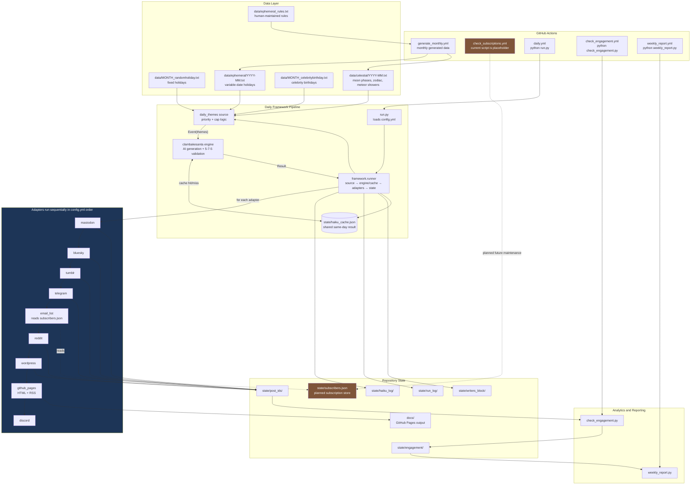

# System Architecture

High-level view of the current ClamBakeSanta implementation: GitHub Actions trigger Python entry points, `framework.runner` executes the plugin pipeline, adapters publish sequentially, and state is committed back to the repository.

## Important implementation notes

- The pipeline is plugin-based, but the active haiku implementation is configured by `config.yml`.
- Adapters are independent but **not parallel**. `framework.runner` iterates through them sequentially in `config.yml` order.
- Missing adapter credentials generally cause that adapter to skip without stopping the run.
- The subscription workflow is scheduled, but the current `check_subscriptions.py` file is placeholder/demo code. The daily email adapter can send to addresses already present in `state/subscribers.json`; automated Gmail-based subscribe/unsubscribe processing is still pending.
- GitHub Actions schedules live in `.github/workflows/*.yml`, not in `config.yml`.
