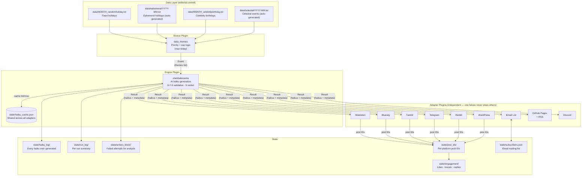

# System Architecture

High-level view of the plugin framework: one source produces an Event, one engine transforms it into a Result, nine adapters publish independently.

```mermaid
flowchart TD
    subgraph DATA["Data Layer (editorial control)"]
        FH["data/MONTH_randomholiday.txt\nFixed holidays"]
        EH["data/ephemeral/YYYY-MM.txt\nEphemeral holidays (auto-generated)"]
        CB["data/MONTH_celebritybirthday.txt\nCelebrity birthdays"]
        CE["data/celestial/YYYY-MM.txt\nCelestial events (auto-generated)"]
    end

    subgraph SOURCE["Source Plugin"]
        DT["daily_themes\nPriority + cap logic\n(max 6/day)"]
    end

    subgraph ENGINE["Engine Plugin"]
        CBS["clambakesanta\nAI haiku generation\n5-7-5 validation · 5 retries"]
        CACHE[("state/haiku_cache.json\nShared across all adapters")]
    end

    subgraph ADAPTERS["Adapter Plugins (independent — one failure never stops others)"]
        MA["Mastodon"]
        BS["Bluesky"]
        TU["Tumblr"]
        TG["Telegram"]
        EL["Email List"]
        RD["Reddit"]
        WP["WordPress"]
        GP["GitHub Pages\n+ RSS"]
        DC["Discord"]
    end

    subgraph STATE["State"]
        HL["state/haiku_log/\nEvery haiku ever generated"]
        RL["state/run_log/\nPer-run summary"]
        WB["state/writers_block/\nFailed attempts for analysis"]
        PI["state/post_ids/\nPer-platform post IDs"]
        EN["state/engagement/\nLikes · boosts · replies"]
        SB["state/subscribers.json\nEmail mailing list"]
    end

    FH & EH & CB & CE --> DT
    DT -->|"Event\n(themes list)"| CBS
    CBS <-->|"cache hit/miss"| CACHE
    CBS --> HL & RL & WB

    CBS -->|"Result\n(haikus + metadata)"| MA & BS & TU & TG & EL & RD & WP & GP & DC

    MA & BS & TU & TG & RD & WP -->|"post IDs"| PI
    PI --> EN
    EL <--> SB
```
