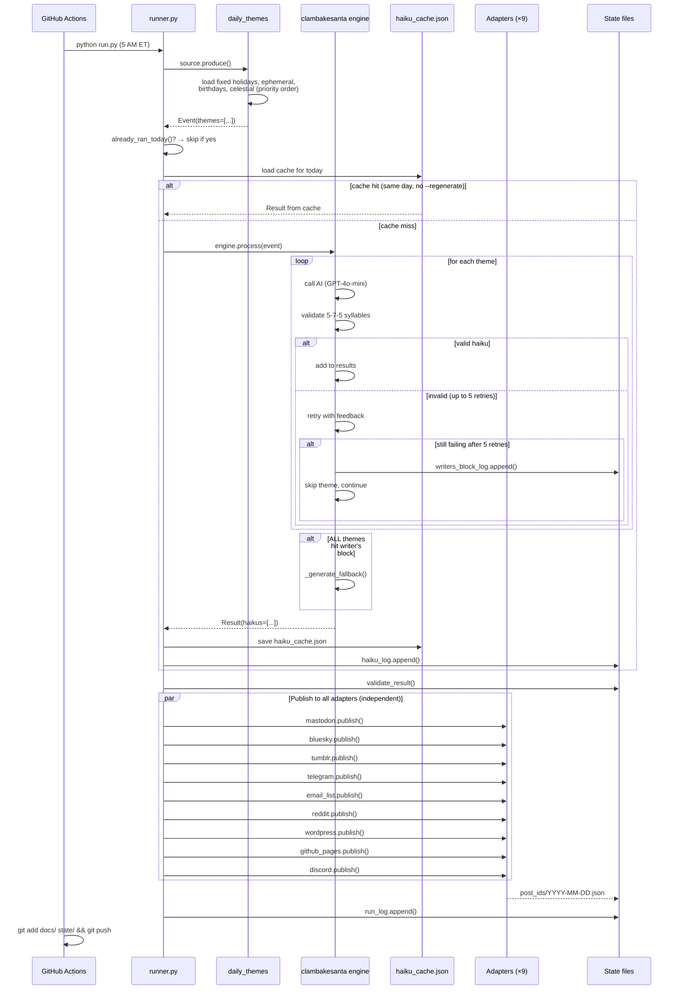

# Daily Workflow Sequence

Step-by-step sequence of a full daily run, from GitHub Actions trigger through all adapters to final state commit.

```mermaid
sequenceDiagram
    participant GHA as GitHub Actions
    participant Runner as runner.py
    participant Source as daily_themes
    participant Engine as clambakesanta engine
    participant Cache as haiku_cache.json
    participant Adapters as Adapters (×9)
    participant State as State files

    GHA->>Runner: python run.py (5 AM ET)

    Runner->>Source: source.produce()
    Source->>Source: load fixed holidays, ephemeral,<br/>birthdays, celestial (priority order)
    Source-->>Runner: Event(themes=[...])

    Runner->>Runner: already_ran_today()? → skip if yes

    Runner->>Cache: load cache for today
    alt cache hit (same day, no --regenerate)
        Cache-->>Runner: Result from cache
    else cache miss
        Runner->>Engine: engine.process(event)
        loop for each theme
            Engine->>Engine: call AI (GPT-4o-mini)
            Engine->>Engine: validate 5-7-5 syllables
            alt valid haiku
                Engine->>Engine: add to results
            else invalid (up to 5 retries)
                Engine->>Engine: retry with feedback
                alt still failing after 5 retries
                    Engine->>State: writers_block_log.append()
                    Engine->>Engine: skip theme, continue
                end
            end
        end
        alt ALL themes hit writer's block
            Engine->>Engine: _generate_fallback()
        end
        Engine-->>Runner: Result(haikus=[...])
        Runner->>Cache: save haiku_cache.json
        Runner->>State: haiku_log.append()
    end

    Runner->>State: validate_result()

    par Publish to all adapters (independent)
        Runner->>Adapters: mastodon.publish()
        Runner->>Adapters: bluesky.publish()
        Runner->>Adapters: tumblr.publish()
        Runner->>Adapters: telegram.publish()
        Runner->>Adapters: email_list.publish()
        Runner->>Adapters: reddit.publish()
        Runner->>Adapters: wordpress.publish()
        Runner->>Adapters: github_pages.publish()
        Runner->>Adapters: discord.publish()
    end

    Adapters-->>State: post_ids/YYYY-MM-DD.json

    Runner->>State: run_log.append()
    GHA->>GHA: git add docs/ state/ && git push
```
