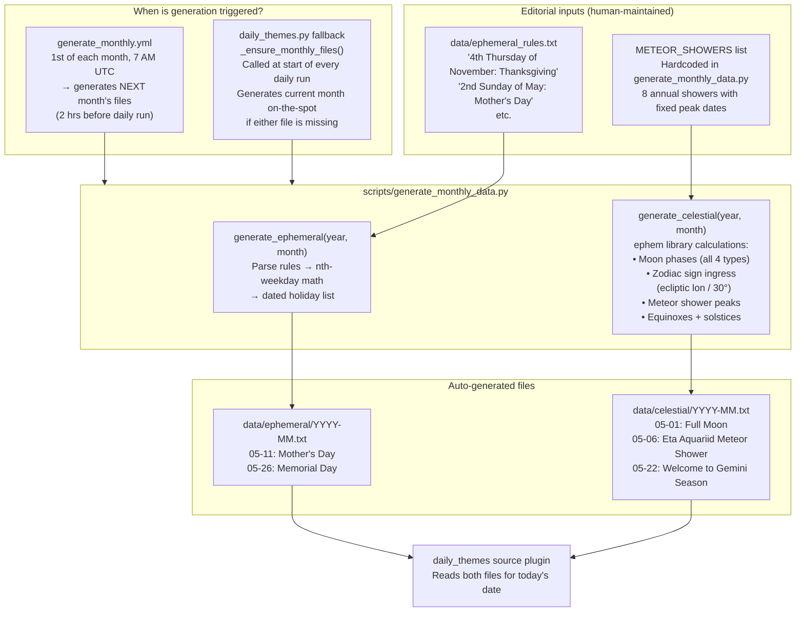

# Monthly Data Generation

How ephemeral and celestial data files are produced and kept current.

```mermaid
flowchart TD
    subgraph RULES["Editorial inputs (human-maintained)"]
        ER["data/ephemeral_rules.txt\n'4th Thursday of November: Thanksgiving'\n'2nd Sunday of May: Mother's Day'\netc."]
        MS["METEOR_SHOWERS list\nHardcoded in generate_monthly_data.py\n8 annual showers with fixed peak dates"]
    end

    subgraph GEN["scripts/generate_monthly_data.py"]
        PE["generate_ephemeral(year, month)\nParse rules → nth-weekday math\n→ dated holiday list"]
        PC["generate_celestial(year, month)\nephem library calculations:\n• Moon phases (all 4 types)\n• Zodiac sign ingress\n  (ecliptic lon / 30°)\n• Meteor shower peaks\n• Equinoxes + solstices"]
    end

    subgraph OUTPUT["Auto-generated files"]
        EF["data/ephemeral/YYYY-MM.txt\n05-11: Mother's Day\n05-26: Memorial Day"]
        CF["data/celestial/YYYY-MM.txt\n05-01: Full Moon\n05-06: Eta Aquariid Meteor Shower\n05-22: Welcome to Gemini Season"]
    end

    subgraph TRIGGER["When is generation triggered?"]
        T1["generate_monthly.yml\n1st of each month, 7 AM UTC\n→ generates NEXT month's files\n(2 hrs before daily run)"]
        T2["daily_themes.py fallback\n_ensure_monthly_files()\nCalled at start of every daily run\nGenerates current month on-the-spot\nif either file is missing"]
    end

    ER --> PE
    MS --> PC
    PE --> EF
    PC --> CF
    T1 --> GEN
    T2 --> GEN

    EF --> SOURCE["daily_themes source plugin\nReads both files for today's date"]
    CF --> SOURCE
```
