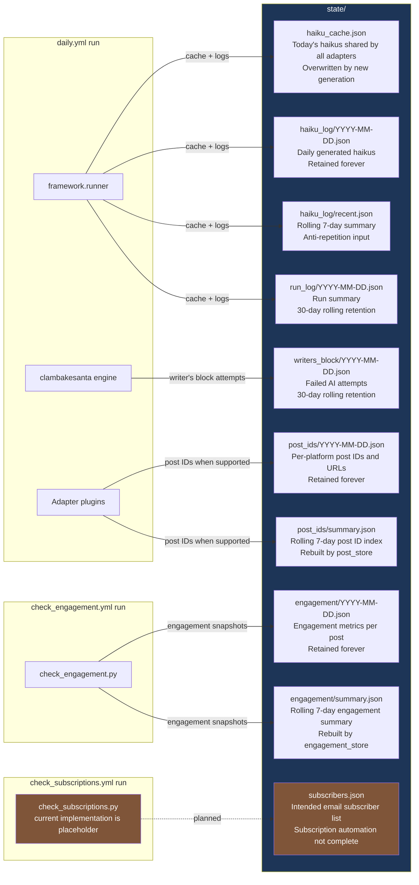

# State File Map

What lives in `state/`, what creates each file, and how long it is retained.

## Current notes

- `state/subscribers.json` is the intended subscriber list location.
- The daily `email_list` adapter reads `state/subscribers.json` and sends the digest to listed addresses.
- The scheduled `check_subscriptions.yml` workflow exists, but the current `check_subscriptions.py` implementation is placeholder/demo code and does not yet poll Gmail, process real SUBSCRIBE/UNSUBSCRIBE mail, or maintain `state/subscribers.json`.

## Retention policy

| Path | Created or maintained by | Retention |
|---|---|---|
| `state/haiku_cache.json` | `framework.runner` | Overwritten by fresh generation |
| `state/haiku_log/YYYY-MM-DD.json` | `framework/haiku_log.py` | Forever |
| `state/haiku_log/recent.json` | `framework/haiku_log.py` | Rolling 7-day rebuild |
| `state/run_log/YYYY-MM-DD.json` | `framework/run_log.py` | 30-day auto-prune |
| `state/writers_block/YYYY-MM-DD.json` | `framework/writers_block_log.py` | 30-day auto-prune |
| `state/post_ids/YYYY-MM-DD.json` | Publishing adapters | Forever |
| `state/post_ids/summary.json` | `framework/post_store.py` | Rolling 7-day rebuild |
| `state/engagement/YYYY-MM-DD.json` | `check_engagement.py` | Forever |
| `state/engagement/summary.json` | `framework/engagement_store.py` | Rolling 7-day rebuild |
| `state/subscribers.json` | Planned subscription management subsystem; read by `email_list` | Live list; not pruned |
