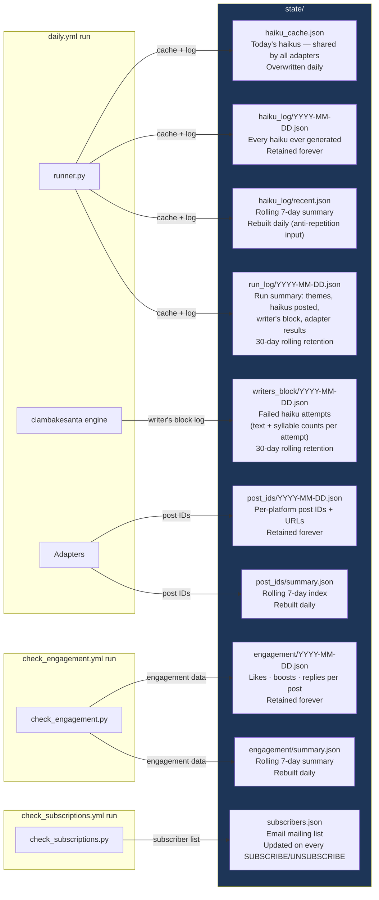

# State File Map

What lives in `state/`, what creates each file, and how long it's retained.

### Retention policy

| Path | Created by | Retention |
|---|---|---|
| `state/haiku_cache.json` | `runner.py` | Overwritten daily |
| `state/haiku_log/YYYY-MM-DD.json` | `framework/haiku_log.py` | Forever |
| `state/haiku_log/recent.json` | `framework/haiku_log.py` | Rolling 7-day rebuild |
| `state/run_log/YYYY-MM-DD.json` | `framework/run_log.py` | 30-day auto-prune |
| `state/writers_block/YYYY-MM-DD.json` | `framework/writers_block_log.py` | 30-day auto-prune |
| `state/post_ids/YYYY-MM-DD.json` | Adapters (mastodon, bluesky, etc.) | Forever |
| `state/post_ids/summary.json` | `framework/post_store.py` | Rolling 7-day rebuild |
| `state/engagement/YYYY-MM-DD.json` | `check_engagement.py` | Forever |
| `state/engagement/summary.json` | `framework/engagement_store.py` | Rolling 7-day rebuild |
| `state/subscribers.json` | `check_subscriptions.py` | Live list — never pruned |
