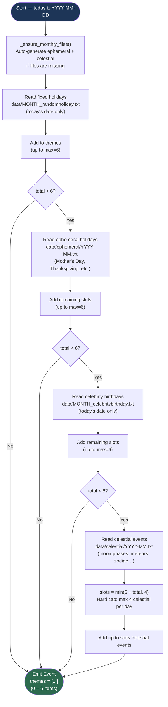

# Theme Selection Logic

How `daily_themes` selects today's haiku subjects using priority order and hard caps.

### Cap summary

| Priority | Source | Hard cap |
|---|---|---|
| 1st | Fixed holidays | up to 6 total |
| 2nd | Ephemeral holidays | up to remaining |
| 3rd | Celebrity birthdays | up to remaining |
| 4th | Celestial events | up to 4, never more |
| — | **Total per day** | **6 maximum** |
