# Workflow Schedule

All GitHub Actions workflows and when they run.

```mermaid
gantt
    title ClamBakeSanta — Daily Workflow Schedule (Eastern Time)
    dateFormat HH:mm
    axisFormat %H:%M

    section Subscriptions
    check_subscriptions.yml (4 AM ET)       : milestone, 04:00, 0m
    Process SUBSCRIBE/UNSUBSCRIBE emails     : 04:00, 5m

    section Monthly Data (1st of month only)
    generate_monthly.yml (3 AM ET / 7 UTC)  : milestone, 03:00, 0m
    Generate ephemeral + celestial files     : 03:00, 3m

    section Daily Run
    daily.yml (5 AM ET)                     : milestone, 05:00, 0m
    Generate haikus                          : 05:00, 3m
    Post to all platforms                    : 05:03, 12m
    Update GitHub Pages + RSS                : 05:15, 2m
    Commit state                             : 05:17, 1m

    section Engagement
    check_engagement.yml (6 PM ET)          : milestone, 18:00, 0m
    Fetch likes / boosts / replies           : 18:00, 3m

    section Weekly (Sundays only)
    weekly_report.yml (9 AM ET Sunday)      : milestone, 09:00, 0m
    Email weekly stats report                : 09:00, 2m
```

## Full schedule reference

| Workflow | Cron (UTC) | Time (ET) | Frequency | Purpose |
|---|---|---|---|---|
| `generate_monthly.yml` | `0 7 1 * *` | 3 AM 1st of month | Monthly | Generate ephemeral + celestial data files for next month |
| `check_subscriptions.yml` | `0 8 * * *` | 4 AM | Daily | Process SUBSCRIBE / UNSUBSCRIBE emails |
| `daily.yml` | `0 9 * * *` | 5 AM | Daily | Generate haikus, post everywhere, update site |
| `check_engagement.yml` | `0 22 * * *` | 6 PM | Daily | Fetch likes / boosts / replies for recent posts |
| `weekly_report.yml` | `0 13 * * 0` | 9 AM Sunday | Weekly | Email ranked engagement report |

All workflows are also available as manual `workflow_dispatch` triggers.
