# Workflow Schedule

All scheduled automation currently lives in `.github/workflows/*.yml`. `config.yml` controls application behavior, plugin selection, adapter order, paths, and content limits; it does **not** control GitHub Actions timing.

```mermaid
gantt
    title ClamBakeSanta — Scheduled GitHub Actions (Eastern Time)
    dateFormat HH:mm
    axisFormat %H:%M

    section Subscription workflow
    check_subscriptions.yml (4 AM ET)       : milestone, 04:00, 0m
    Current script is placeholder/demo code : 04:00, 5m

    section Monthly Data (1st of month only)
    generate_monthly.yml (3 AM ET / 7 UTC)  : milestone, 03:00, 0m
    Generate ephemeral + celestial files     : 03:00, 3m

    section Daily Run
    daily.yml (5 AM ET)                     : milestone, 05:00, 0m
    Generate/cache haikus                    : 05:00, 3m
    Run adapters sequentially                : 05:03, 12m
    Update GitHub Pages + RSS                : 05:15, 2m
    Commit docs/ and state/                  : 05:17, 1m

    section Engagement
    check_engagement.yml (6 PM ET)          : milestone, 18:00, 0m
    Fetch engagement metrics                 : 18:00, 3m

    section Weekly (Sundays only)
    weekly_report.yml (9 AM ET Sunday)      : milestone, 09:00, 0m
    Email weekly stats report                : 09:00, 2m
```

## Full schedule reference

| Workflow | Cron (UTC) | Time (ET) | Frequency | Current purpose/status |
|---|---:|---:|---|---|
| `generate_monthly.yml` | `0 7 1 * *` | 3 AM, 1st of month | Monthly | Generates next month's `data/ephemeral/` and `data/celestial/` files. Also has manual bootstrap/force inputs. |
| `check_subscriptions.yml` | `0 8 * * *` | 4 AM | Daily | Workflow exists, but current `check_subscriptions.py` is placeholder/demo code. Real Gmail polling and subscriber maintenance are not yet implemented. |
| `daily.yml` | `0 9 * * *` | 5 AM | Daily | Runs `python run.py` or `python run.py --force`, generates/caches haikus, runs adapters, updates `docs/` and `state/`, commits changes. |
| `check_engagement.yml` | `0 22 * * *` | 6 PM | Daily | Fetches recent engagement metrics from platforms with available credentials and stored post IDs. |
| `weekly_report.yml` | `0 13 * * 0` | 9 AM Sunday | Weekly | Emails ranked engagement report to `REPORT_EMAIL`. |

## Manual triggers

All listed workflows expose `workflow_dispatch`.

Current manual inputs:

- `daily.yml`: `force` only. `run.py` supports `--regenerate`, but the workflow does not currently expose a regenerate input.
- `generate_monthly.yml`: `month`, `bootstrap`, and `force`.
- `check_engagement.yml`: `days`.
- `weekly_report.yml`: `days`.
- `check_subscriptions.yml`: no inputs.
