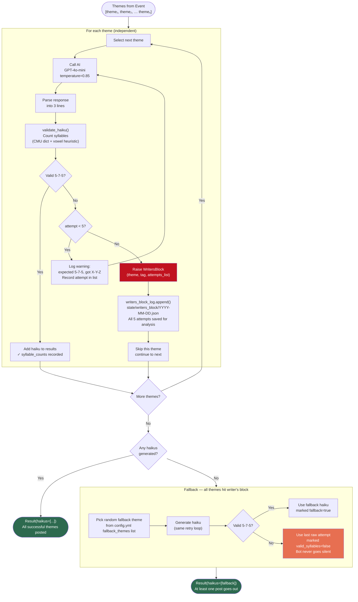

# Writer's Block Handling

How the engine handles syllable failures: per-theme isolation, retry loop, fallback haiku.

```mermaid
flowchart TD
    THEMES(["Themes from Event\n[theme₁, theme₂, … themeₙ]"])
    THEMES --> LOOP

    subgraph LOOP["For each theme (independent)"]
        PICK["Select next theme"] --> GEN

        GEN["Call AI\nGPT-4o-mini\ntemperature=0.85"] --> PARSE

        PARSE["Parse response\ninto 3 lines"] --> VALIDATE

        VALIDATE["validate_haiku()\nCount syllables\n(CMU dict + vowel heuristic)"] --> CHECK

        CHECK{Valid 5-7-5?}
        CHECK -- Yes --> KEEP["Add haiku to results\n✓ syllable_counts recorded"]

        CHECK -- No --> RETRY{attempt < 5?}
        RETRY -- Yes --> LOG_WARN["Log warning:\nexpected 5-7-5, got X-Y-Z\nRecord attempt in list"]
        LOG_WARN --> GEN

        RETRY -- No --> WB["Raise WritersBlock\n(theme, tag, attempts_list)"]
        WB --> LOG_WB["writers_block_log.append()\nstate/writers_block/YYYY-MM-DD.json\nAll 5 attempts saved for analysis"]
        LOG_WB --> SKIP["Skip this theme\ncontinue to next"]
    end

    KEEP --> NEXT{More themes?}
    SKIP --> NEXT
    NEXT -- Yes --> PICK
    NEXT -- No --> CHECK_EMPTY

    CHECK_EMPTY{Any haikus\ngenerated?}
    CHECK_EMPTY -- Yes --> RESULT(["Result(haikus=[...])\nAll successful themes posted"])

    CHECK_EMPTY -- No --> FALLBACK

    subgraph FALLBACK["Fallback — all themes hit writer's block"]
        FB_PICK["Pick random fallback theme\nfrom config.yml fallback_themes list"]
        FB_PICK --> FB_GEN["Generate haiku\n(same retry loop)"]
        FB_GEN --> FB_CHECK{Valid 5-7-5?}
        FB_CHECK -- Yes --> FB_OK["Use fallback haiku\nmarked fallback=true"]
        FB_CHECK -- No --> FB_LAST["Use last raw attempt\nmarked valid_syllables=false\nBot never goes silent"]
    end

    FALLBACK --> RESULT_FB(["Result(haikus=[fallback])\nAt least one post goes out"])

    style RESULT fill:#2d6a4f,color:#fff
    style RESULT_FB fill:#2d6a4f,color:#fff
    style WB fill:#c1121f,color:#fff
    style FB_LAST fill:#e76f51,color:#fff
```
