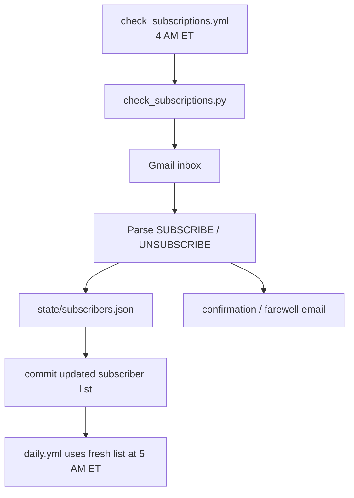

# Subscription System Status

This document describes the current implementation status of ClamBakeSanta email subscriptions.

## Summary

The email delivery adapter exists, but automated subscription management is not complete.

The project currently has three separate subscription-related pieces:

| Area | Status | Notes |
|---|---|---|
| Daily email delivery | Implemented | `plugins/adapters/email_list.py` sends the daily digest to addresses listed in `state/subscribers.json` when Gmail credentials are configured. |
| Subscriber state file | Intended / partially used | `state/subscribers.json` is the expected source of subscriber addresses for the email adapter. |
| Automated subscribe/unsubscribe processing | Not yet implemented | `check_subscriptions.yml` exists, but `check_subscriptions.py` is currently placeholder/demo code. |

## What works today

### Daily digest delivery

`email_list` is an adapter in the normal daily pipeline. During `daily.yml`, the runner executes adapters sequentially in the order listed in `config.yml`.

When these secrets are configured, the adapter can send mail through Gmail SMTP:

- `GMAIL_ADDRESS`
- `GMAIL_APP_PASSWORD`

The adapter reads subscribers from:

```text
state/subscribers.json
```

Expected shape:

```json
{
  "subscribers": [
    "reader@example.com"
  ]
}
```

If the Gmail secrets are missing, the adapter skips. If the subscriber list is empty or missing, the adapter does not send a digest.

## What does not work yet

### Inbox polling

The scheduled workflow exists:

```text
.github/workflows/check_subscriptions.yml
```

It runs daily at 08:00 UTC / 4:00 AM Eastern and can also be triggered manually.

However, the current script:

```text
check_subscriptions.py
```

is placeholder/demo code. It does not yet:

- Connect to the real Gmail inbox
- Search for incoming SUBSCRIBE messages
- Search for incoming UNSUBSCRIBE messages
- Update `state/subscribers.json`
- Send real confirmation or farewell messages
- Commit subscriber changes based on real inbox activity

## Intended future behavior

The intended subscription-processing workflow is:



## Recommended implementation phases

### Phase 1 — Minimum viable subscriber processor

- Authenticate to Gmail using `GMAIL_ADDRESS` and `GMAIL_APP_PASSWORD`
- Poll unread or recent inbox messages
- Match subject/body commands:
  - `SUBSCRIBE`
  - `UNSUBSCRIBE`
- Normalize sender email addresses
- Add/remove addresses in `state/subscribers.json`
- Avoid duplicates
- Commit state changes only when the list changes

### Phase 2 — User feedback

- Send confirmation email after subscribing
- Send farewell email after unsubscribing
- Mark processed messages so they are not reprocessed
- Add logs that avoid exposing email addresses in full

### Phase 3 — Hardening

- Bounce handling
- Abuse/rate limiting
- Invalid command handling
- Optional allow/block lists
- Tests for subscriber state updates

## Documentation rule

Until `check_subscriptions.py` is replaced with real mailbox-processing logic, docs should describe subscription automation as **planned / incomplete**, not production-ready.
